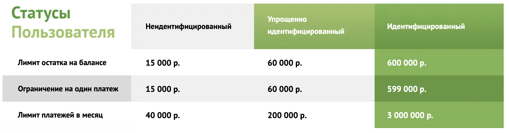
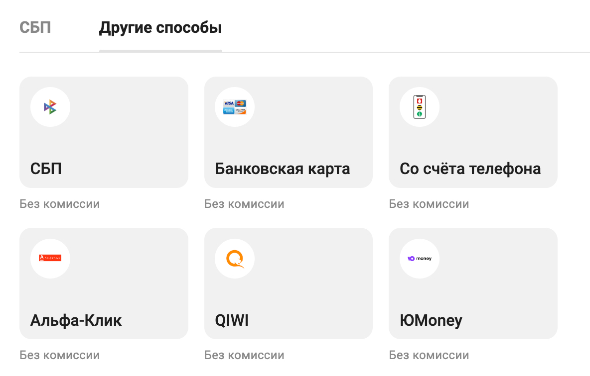
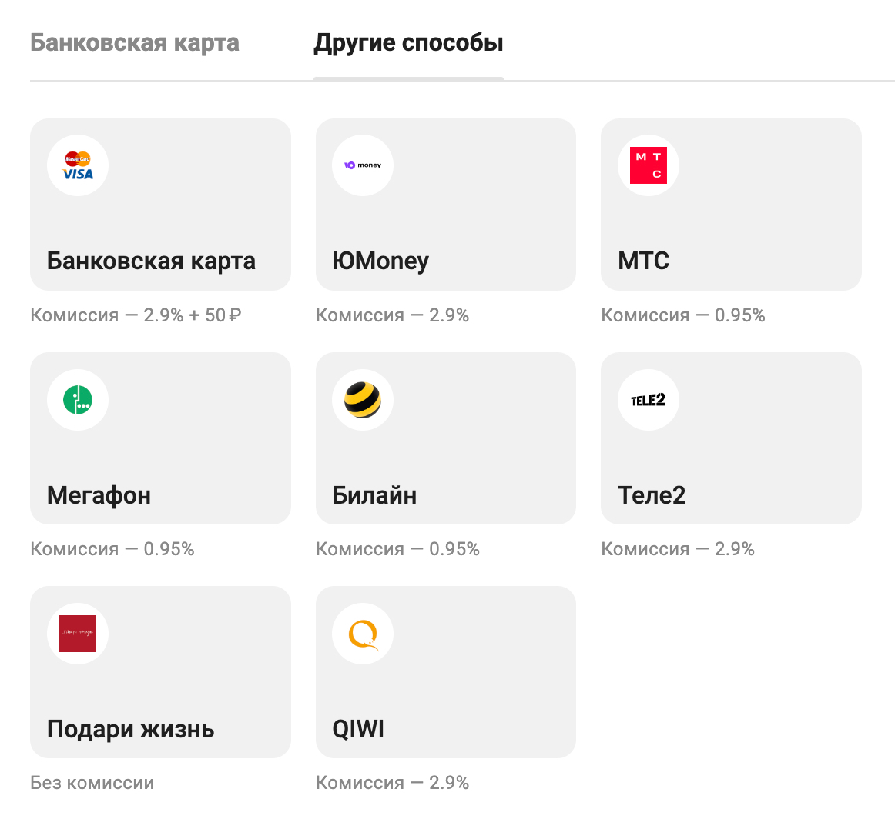

# Общие сведения

# **Термины и определения**

## Кошелек

**Электронный кошелек** - счет пользователя, открытый в банковской организации. Кошелек предназначен для совершения финансовых операций: пополнение счета, покупка, донаты, получение денежных средств и вывод.

## Пользователь

**Пользователь** - владелец кошелька, являющийся пользователем в рамках системы Партнера.

## **Партнер**

**Партнер** - юридическое лицо, заключившее партнерское соглашение  с банковской организацией на эмиссию электронных кошельков для пользователей Партнера и управлению кошельками через интерфейсы Партнера.

## **Идентификация**

**Идентификация** - процесс подтверждения личности пользователя в банковской организации для расширения возможностей работы с кошельком и увеличения значений лимитов. Существует 2 уровня идентификации: упрощенная и полная идентификация. Изначально пользователю открывается анонимный кошелек. Упрощенная идентификация доступна через Госуслуги и ФНС, полную идентификацию можно пройти путем подачи заявки на видео звонок либо при личном посещении офиса банковской организации.

В зависимости от уровня ИД пользователю кошелька доступны след. возможности:

| Уровень идентификации        | Пополнение кошелька | Вывод с кошелька | Покупки | Выплаты | Донаты (получение) | Донаты (отправка)** |
| ---------------------------- | ------------------- | ---------------- | ------- | ------- | ------------------ | ------------------- |
| Неидентифицированный         | +                   | -  *             | +       | +       | -                  | +                   |
| Упрощенно идентифицированный | +                   | +                | +       | +       | +                  | +                   |
| Идентифицированный           | +                   | +                | +       | +       | +                  | +                   |

\*-  можно выводить на юридические лица суммы до 15 000 р. (в соответствии с лимитами). Запрещены выводы на счета физических лиц (банковские карты, другие кошельки и пр.)

\*\*- донат можно отправить путем пополнения кошелька получателя с идентифицированного метода платежа (карта, СБП, др кошельки и пр.)

## Лимит

**Лимит** - максимальные значения остатка денежных средств на электронном кошельке и суммы расходных операций в месяц. Лимиты регламентируются в соответствии с требованиями законодательства РФ.

## **Баланс**

**Баланс** - суммарный показатель средств крашенного и не крашенного счетов одного конкретного кошелька. В рамках доступных средств на балансе можно совершать расходные операции - покупки и выводы.

**Крашенный счет** - счет пользователя с которого нельзя вывести деньги. Средства, вводимые в систему извне (пополнение кошелька) поступают только на данный счет. Средства, доступные на данном счете можно использовать только для покупки у Партнера.

**Неокрашенный счет** - счет пользователя, с которого возможно вывести деньги во внешнюю систему (на провайдера). Также используется для получения выплат от Партнера и получения донатов

**Сверхлимитный счет** - счет пользователя, на который зачисляется излишек поступивших денежных средств при достижении лимита по остатку. Денежные средства со сверхлимитного счета переходят на основной при освобождении лимита, например после расходной операции (покупка, вывод). Сверхлимитный счет может пополниться после следующих операций: пополнение кошелька, выплата, получение донатов.

Структура пользовательского кошелька:
Каждый кошелек пользователя в системе имеет 4 счета:

| Счет                          | Описание                                                                                                       |
| ----------------------------- | -------------------------------------------------------------------------------------------------------------- |
| Неокрашеный счет              | Денежные средства доступные для вывода и покупок                                                               |
| Крашеный счет                 | Денежные средства доступные только для покупок в системе Партнера                                              |
| Счет сверхлимита неокрашеный  |                                                                                                                |
| Оверпей (Overpay) неокрашеный | Счет на который поступают денежные средства, не вошедшие в сумму лимита. Overpay счет для "неокрашеного" счета |
| Счет сверхлимита крашеный     |                                                                                                                |
| Оверпей (Overpay) крашеный    | Счет на который поступают денежные средства, не вошедшие в сумму лимита. Overpay счет для "крашеного" счета    |

## Платежные страницы

**Платежные страницы** - интерфейс, доступный пользователям системы по специально генерируемой ссылке. На данных интерфейсах возможно осуществлять:

- пополнение кошелька
- вывод средств
- идентификация
- просмотр статуса кошелька и истории операций

## **Пополнение кошелька**

**Пополнение кошелька** — увеличение баланса кошелька, инициируемое самим пользователем. Для осуществления операции пополнения пользователя необходимо переадресовать на соответствующий интерфейс Платежных страниц, где будет доступен выбор агента пополнения, поле ввода реквизитов, поле ввода суммы пополнения и кнопка подтверждения.

## Вывод средств

**Вывод средств** — уменьшение баланса кошелька, инициируемое самим пользователем по средству перевода денежных средств на указанные пользователям реквизиты выбранного провайдера. Для осуществления операции вывода пользователя необходимо переадресовать на соответствующий интерфейс Платежных страниц, где будет доступен выбор провайдера, поле ввода реквизитов, поле ввода суммы вывода и кнопка подтверждения. На операции вывода средств накладываются ограничения: лимиты.

## Агент

**Агент** -  юридическое лицо, через которое происходит процесс пополнения баланса кошельков пользователей. Через агента денежные средства зачисляются на счет пользователя в РНКО.

Пример: МТС, QIWI, Банковская карта, SberPay и т.д.

Состав агентов (способов пополнения средств) на платежных страницах зависит от условий договорных отношений Партнера с Банковской организацией. При недоступности агентского шлюза (технического канала) агент может быть временно деактивирован с платежных страниц.

Для платежных страниц возможно настраивать приоритизацию (очередность) показа агентов, а так же настроить агента по умолчанию (это тот агент, на страницу ввода реквизитов которого пользователь попадает по умолчанию. Выбрать другого агента можно по клику на кнопку “Другие”).

## Провайдер

**Провайдер** - юридическое лицо, через которое происходит процесс вывода средств с  баланса кошельков пользователей. Через провайдера денежные средства перечисляются со счета пользователя в Банковской организации на указанные реквизиты.

Пример: МТС, QIWI, Банковская карта, SberPay и т.д.

Состав провайдеров (способов вывода средств) на платежных страницах зависит от условий договорных отношений Партнера с Банковской организацией. При недоступности технического канала провайдер может быть временно деактивирован с платежных страниц.

## Комиссии

На агентов и провайдеров можно настроить комиссии, которые будут учитываться отдельными проводками в транзакциях на пополнение и вывод денежных средств с кошельков.

Типы комиссий:

- Верхняя с пользователя
- Нижняя с пользователя
- Комиссия агенту/провайдеру
- Комиссия с агента/провайдера
- Комиссия Партнеру
- Комиссия с Партнера
- Комиссия Банковской организации

Возможные значения:

- Процент
- Фиксированная в рублях
- Минимальная в рублях
- Комбинированная (Процент + фикс + мин)

## Мицелиум API

**[Мицелиум API](https://w1.stoplight.io/docs/mycellium-api/branches/main/zga4nfu02mpxz-api)** - протокол обмена данными, через который Партнер осуществляет эмиссию и взаимодействие с кошельками своих пользователей в системе.

# Основные операции с кошельком пользователя

## Регистрация нового кошелька. **RegisterUser**

Для создания нового кошелька необходимо использовать метод **[POST /wallet](https://w1.stoplight.io/docs/mycellium-api/branches/main/xdqza2o2sm4wt-post-wallet)** из Мицелиум API. В случае корректного запроса, моментально создается новый кошелек.

Для регистрации кошелька Партнер предоставляет контактные данные пользователя (**email** или **phone**) и уникальный идентификатор из своей системы (**externalId**). В случае успешного запроса, Партнер получает номер кошелька пользователя (уникальный walletNumber) в системе Мицелиум. Партнер сохраняет на своей стороне полученный номер кошелька для дальнейших операций с ним.

В случае если Кошелек с таким внешним идентификатором уже создавался ранее – вернется номер уже имеющегося Кошелька.

В случае если в запросе не переданы значения **email** или **phone**, сервис вернет ошибку.

После создания кошелька он сразу готов к работе с финансовыми операциями.

## Баланс кошелька. **GetUserBalance**

Для получения информации по балансу определенного кошелька  необходимо использовать метод  **[GET /wallet/{walletNumber}/balance](https://w1.stoplight.io/docs/mycellium-api/branches/main/40rto1k6uoosg-get-user-balance)** из Мицелиум API.

Ответ сервиса позволит Партнеру узнать все о текущем балансе кошелька пользователя. В ответе будет информация:

- текущий остаток на кошельке (**amount**);
- сверхлимитная сумма на кошельке;
- cумма кредитного лимита доступного для расходования (**overdraft)**;
- итоговая сумма доступная для расходования = Amount + Overdraft;
- сумма средств, ограниченная для вывода во внешние системы;
- уровень идентификации пользователя;
- статус последнего запроса на идентификацию.

## Пополнение кошелька

Для пополнения кошелька нужно перенаправить пользователя в интерфейс Платежных страниц, где предоставлен выбор из доступных платежных инструментов.

## Покупки с кошелька. **CreatePurchase**

Для совершения покупки необходимо использовать метод **[POST /purchase](https://w1.stoplight.io/docs/mycellium-api/branches/main/687mq3aw50d7x-post-purchase)** из Мицелиум API.

Для совершения покупки (товара, доступа, подписки, услуги) со своего кошелька, пользователь должен иметь средства на балансе.

Процесс списания средств с баланса осуществляется со следующим приоритетом:

- Снятие суммы с "крашеного" счета кошелька пользователя.
- Если на “крашеном” счете не хватает средств, то снимается недостающая сумма с “неокрашеного” счета.
- Если после покупки на счете "оверпей крашеный" есть остаток, а сумма счетов (крашеного и неокрашеного) меньше лимита, то на "крашеный" счет со счета "оверпей крашеный" переводятся вся сумма счета, но не превышающая установленного лимита.
- Если после покупки на счете "оверпей неокрашеный" есть остаток, а сумма счетов (крашеного и неокрашеного) меньше лимита, то на "неокрашеный" счет со счета "оверпей неокрашеный" переводятся вся сумма счета но не превышающая установленного лимита.

Результатом операции станет зачисления необходимой суммы с кошелька пользователя на кошелек Партнера.

Сумма операции указывается в запросе на покупку по API.

При совершении операций учитываются лимиты данного кошелька и его уровень идентификации.

## Донаты

Определенный вид операций, подразумевающий безвозмездное пополнение кошелька другого пользователя.

Донат возможен как операция пополнения кошелька, только в случае доната - денежные средства поступают не на кошелек пользователя, а на указанный кошелек получателя доната.

Пополнение чужого кошелька можно осуществить только идентифицированным методом платежа (карта, СБП, другой кошелек и пр.).

Для совершения операции необходимо чтобы пополняемый донатом кошелек прошел идентификацию.

Так же возможен донат с баланса кошелька инициатора на кошелек получателя, в случае наличия идентификации на обоих кошельках.

## Выплата на кошелек. **CreatePayout**

Для совершения выплаты необходимо использовать метод **[POST /payout](https://w1.stoplight.io/docs/mycellium-api/branches/main/xxe18pbnk81vt-post-payout)**  из Мицелиум API.

Для совершения выплаты на кошелек пользователя, на кошельке Партнера должна быть необходимая сумма для данной операции. Зачисление средств происходит путем трансфера денежных средств с кошелька Партнера на кошелек пользователя.

## Вывод с кошелька

Для осуществления операции по выводу денежных средств с кошелька, пользователь должен иметь необходимую сумму денежных средств на неокрашенном счете. Вывести денежные средства с крашенного счета - невозможно.

Операция вывода средств происходит через интерфейс Платежных страниц. После переадресации на Платежные страницы пользователь выбирает удобный способ, указывает реквизиты, сумму и осуществляет вывод.

## Передача персональных данных

Сбор, проверка и дальнейшая обработка персональных данных клиентов Партнера происходит в соответствии с законодательством РФ.

Банковская организация имеет опцию передачи персональных данных пользователей Партнеру если это не противоречит оферте с пользователями.

Партнеру доступны синхронные и асинхронные запросы персональных данных по номеру кошелька.

Вся информация, передаваемая Партнеру происходит по https протоколу с использованием  криптографических средств (АПКШ).
