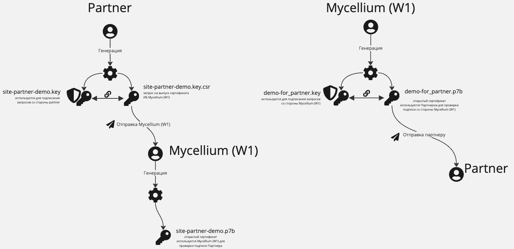

# Взаимодействие с партнерами


###### История изменений документа
(версия 1.0)


| Дата       | Версия документа | Описание                          
| ---------- | ---------------- | --------------------------------- 
| 17.06.2024 | 1.0              | Создана страница
| 12.03.2025 | 1.1              | Актуализировано описание. Добавлены и расписаны более подробно некоторые пункты. 


### Схема по генерации и обмену ключами между Mycellium и Партнером




### Порядок подключения партнера на стенды Mycellium

1. Подключение партнера на демо стенд. (На первичном этапе Mycellium передает все необходимые сгенерированные сертификаты Партнеру. Партнер использует их для подписывания запросов в API)
2. Тестирование основных методов API.
3. Генерация партнером сертификатов для демо стенда. 
4. Обмен публичными ключами. 
5. Замена сертификатов на демо среде.
6. Тестирование основных методов API. Партнер использует закрытый ключ, сгенерированный на своей стороне.
7. Генерация партнером сертификатов для прод стенда.
8. Подключение партнера на прод стенд.


### Инструкция по генерации ключей

1. Используя OpenSSL генерируете ваш приватный ключ (site-{partner}-demo.key) и запрос на выпуск сертификата (site-{partner}-demo.key.csr)

Команда:

```curl
openssl req -new -sha256 -nodes -out site-{partner-name}-demo.key.csr -newkey rsa:2048 -keyout site-{partner-name}-demo.key -config config
```


Содержимое файла конфигурации config:

```curl
[req]
default_bits = 2048
prompt = no
default_md = sha256
#req_extensions = req_ext
distinguished_name = dn

[ dn ]
C=RU
ST=(Укажите краткое наименование города – например MSK)
L=(Укажите полное наименование города – например Moscow)
O=(Укажите наименование организации)
OU= (Укажите департамент/отдел)
emailAddress=(Укажите почтовый адрес – например key@partner.ru)
CN = site-{partner}-demo
```

2. Конвертируете ключ в формат PKCS#8 командой:
```json
openssl pkcs8 -topk8 -inform PEM -outform PEM -in ИМЯ_ФАЙЛА -out ИМЯ_ФАЙЛА -nocrypt
```

3. Созданный запрос на выпуск сертификата (csr файл с именем site-{partner}-prod.key.csr) передаете в Mycellium  на почту ithelpme@w1.money
4. Mycellium  генерирует public сертификат (в формате p7b) на основе вашего csr, далее этим сертификатом проверяется подпись Партнера в Request в API.
5. Mycellium  генерирует открытый и закрытый ключ на своей стороне для подписания Responce в API. Открытыую часть (public key в формате p7b) передает Партнеру. Партер использует данный ключ для проверки подписи Mycellium в поле "ResponseSignature" в Response API

6. Cодержимое вашего приватного ключа из пункта 1 (site-{partner-name}-prod.key), используете для подписания запросов к API

7. На API Mycellium нужно протестировать: 
    - Любой GET метод, например, [Запрос баланса кошелька](https://w1.stoplight.io/docs/mycellium-api/branches/main/40rto1k6uoosg-get-user-balance)
    - Любой POST метод, например, [Регистрацию кошелька](https://w1.stoplight.io/docs/mycellium-api/branches/main/xdqza2o2sm4wt-post-wallet)


